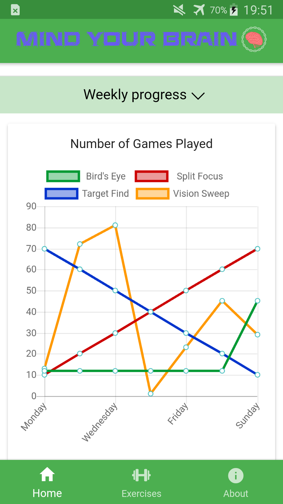
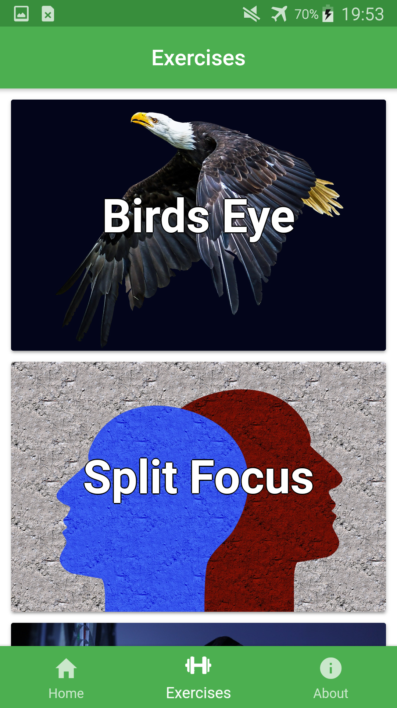
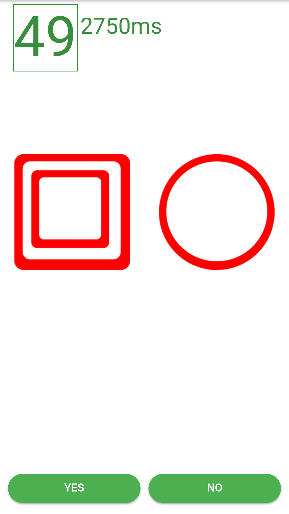

Mind Your Brain is an app designed for iOS and Android with the hopes of slowing the onset of Alzheimer's Disease and improving
mental sharpness of its users. I have not done any studies on whether the app's exercises do live up to these claims. However, they
are loosely based off of similar games that do claim to work.

This app was designed for my own entertainment and to learn more about mobile app development. When this app makes it to the app stores,
it will always be free to use.

Here are some screenshots from the app

Questions and comments about this app can be sent to my school email: Halloranm8@students.rowan.edu
